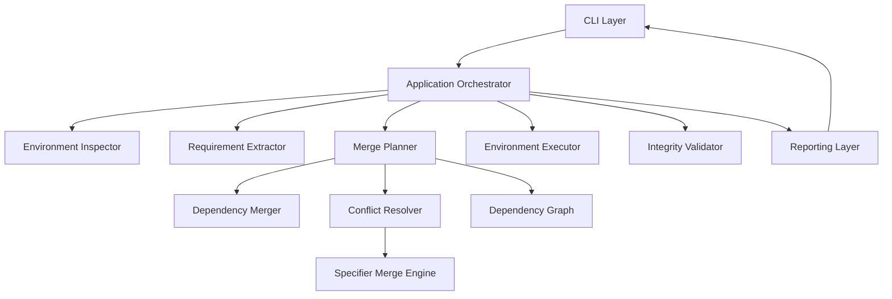
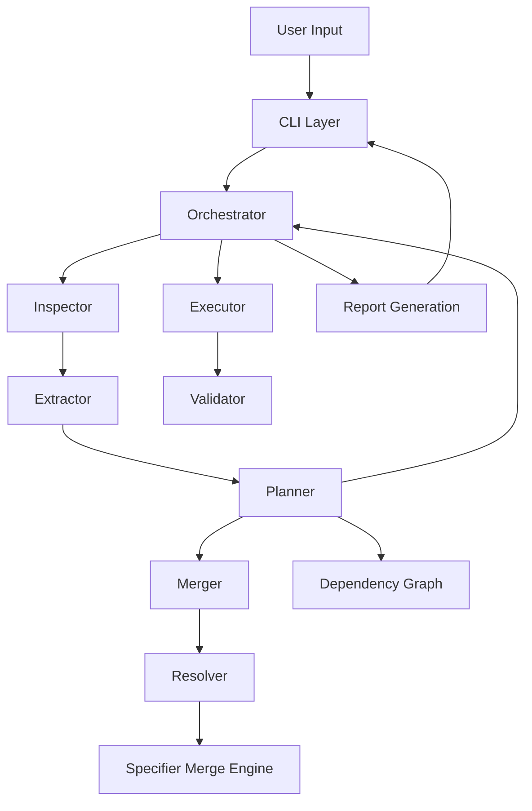

# 🏗️ High-Level System Architecture



---

# 📁 Final Project Structure

```
Pyvenvmerge/
├── 📁 src
│   └── 📁 pyvenvmerge
│       ├── 📁 core
│       │   ├── 🐍 __init__.py
│       │   ├── 🐍 dependency_graph.py
│       │   ├── 🐍 executor.py
│       │   ├── 🐍 extractor.py
│       │   ├── 🐍 inspector.py
│       │   ├── 🐍 merger.py
│       │   ├── 🐍 planner.py
│       │   ├── 🐍 reporting.py
│       │   ├── 🐍 resolver.py
│       │   ├── 🐍 specifier_merge.py
│       │   └── 🐍 validator.py
│       ├── 📁 infra
│       │   ├── 🐍 __init__.py
│       │   ├── 🐍 exceptions.py
│       │   └── 🐍 subprocess_runner.py
│       ├── 📁 models
│       │   ├── 🐍 __init__.py
│       │   ├── 🐍 conflict.py
│       │   ├── 🐍 environment.py
│       │   ├── 🐍 merge_plan.py
│       │   ├── 🐍 merge_report.py
│       │   └── 🐍 requirement.py
│       ├── 🐍 __init__.py
│       ├── 🐍 __main__.py
│       ├── 🐍 cli.py
│       └── 🐍 orchestrator.py
├── 📁 tests
│   ├── 🐍 test_conflicts.py
│   ├── 🐍 test_dependency_types.py
│   ├── 🐍 test_integration_merge.py
│   ├── 🐍 test_json_output.py
│   ├── 🐍 test_merger.py
│   ├── 🐍 test_planner.py
│   ├── 🐍 test_reporting.py
│   ├── 🐍 test_specifier_merge.py
│   └── 🐍 test_strategies.py
├── ⚙️ .gitignore
├── 📝 ARCHITECTURE.md
├── 📝 CHANGELOG.md
├── 📄 LICENSE
├── 📝 README.md
└── ⚙️ pyproject.toml
```

---

# 🔷 Layer 1 — CLI Layer

`cli.py`

Responsibilities:

- Parse command-line arguments
- Validate CLI input
- Trigger dry-run or execution mode
- Format console/JSON output
- Handle exit codes and user-facing errors

This layer contains no merge logic.

---

# 🔷 Layer 2 — Orchestrator Layer

`orchestrator.py`

Coordinates the ull merge workflow.

Execution flow:

```text
1. Inspect environments
2. Extract dependencies
3. Create MergePlan
4. Resolve conflicts
5. Execute merge
6. Validate final environment
7. Generate output report
```

The orchestrator delegates all implementation details to lower layers.

---

# 🔷 Layer 3 — Core Processing Layer

### 1️⃣ inspector.py

Validates Python virtual environments:

Checks:

- Environment path existence
- `pyvenv.cfg` presence
- Python interpreter existence
- Python version compatibility

Returns:

```Python
Environment(
    path: Path,
    python_version: str,
    interpreter_path: Path
)
```

---

### 2️⃣ extractor.py

Extracts and parses dependencies using:

```bash
python -m pip freeze
```

Supported dependency types:

- PyPI packages
- Editable installs (`-e`)
- Git dependencies (`git+...`)
- File dependencies (`package @ file://...`)

Produces structured `Requirement` objects.

---

### 3️⃣ merger.py

Combines dependency collections from multiple environments.

Responsibilities:

- Aggregate package requirements
- Forward conflicts to resolver layer
- Produce unified dependency mapping

No version resolution logic exists here.

---

### 4️⃣ resolver.py

Handles dependency conflict resolution.

Supported strategies:

- `highest`
- `strict`
- `unpinned`

Resolution behavior:

| Dependency Type | Behavior               |
| --------------- | ---------------------- |
| PyPI            | Specifier-based merge  |
| Non-PyPI        | Exact-match validation |
| Mixed Source    | Conflict               |

---

### 5️⃣ specifier_merge.py

Core semantic version resolution engine.

Responsibilities:

- Merge `SpecifierSet` constraints
- Compute valid version intersections
- Detect incompatible constraints
- Normalize merged constraints

Examples:

```text
>=1.0 + <=1.0 → ==1.0
```

Used internally by resolver strategies.

---

### 6️⃣ dependency_graph.py (v0.6 upgrade)

Builds package relationship graph using:

```python
importlib.metadata
```

Responsibilities:

- Map package dependencies
- Enable transitive dependency analysis
- Support semantic validation logic

---

### 7️⃣ planner.py (v0.5 upgrade)

Central analysis engine for merge planning.

Responsibilities:

- Conflict classification
- Dependency validation
- Warning generation
- Compatibility analysis
- Risk estimation
- Merge scoring

Planner outputs a complete `MergePlan` before execution.

---

### 8️⃣ executor.py

Builds the merged virtual environment.

Responsibilities:

- Create target environment
- Upgrade base tooling
- Install dependencies
- Separate installation phases

Installation pipeline:

```text
Phase 1 → PyPI dependencies
Phase 2 → External dependencies
```

This improves installation stability and reproducibility.

---

### 9️⃣ validator.py

Performs final integrity verification.

Uses:

```bash
pip check
```

Ensures:

- No broken requirements
- No unresolved dependency conflicts

---

# 🔷 Infrastructure Layer

### subprocess_runner.py

Centralized subprocess execution wrapper.

Responsibilities:

- Process execution
- stdout/stderr capture
- Exit-code handling
- Timeout management

Prevents subprocess duplication across modules.

---

### exceptions.py

Defines project-specific exception hierarchy.

Provides:

- Consistent failure handling
- Structured error propagation
- Cleaner CLI reporting

---

# 🔷 Models Layer

Structured internal data representation.

---

### requirement.py

Represents parsed dependency metadata.

Fields:

```text
name
specifier
extras
marker
source_type
raw_line
```

Supports PEP 400 / PEP 508 semantics.

---

### environment.py

Represents validated virtual environments.

Stores:

- Environment path
- Interpreter path
- Python version

---

### merge_plan.py

Represents the full merge execution plan.

Contains:

- Environments
- Merged dependencies
- Conflicts
- Warnings
- Compatibility score
- Risk level

Used by:

- Dry-run mode
- JSON reporting
- Execution layer

---

### merge_report.py

Reserved reporting abstraction layer.

Intended future usage:

- Persistant reports
- Export formats
- Structured audit output

---

### Compatibility Analysis System

The planner performs safety analysis before execution.

Metrics include:

| Metric                  | Purpose                               |
| ----------------------- | ------------------------------------- |
| Compatibility Score     | Quantifies merge stability            |
| Risk Level              | Estimates merge risk                  |
| Conflict Classification | Identifies conflict severity          |
| Semantic Validation     | Detects invalid dependency selections |

---

# 🔄 Data Flow



---

# 🧠 Design Principles

1. No direct modification of venv internals
2. Deterministic environment reconstruction
3. Strategy-based conflict resolution
4. Strict layer separation
5. Reusable core independent of CLI
6. Semantic correctness over heuristic matching
7. Explicit dependency source classification
8. Predictable and reproducible execution

---

# 📦 Future Directions

Planned extensions:

- Lockfile generation
- Interactive conflict resolution
- Dependency caching
- Parallel installation
- Exportable merge reports
- Advanced semantic resolution
- pyproject.toml export support

---

# 🔐 Failure Handling Design

Every processing stage follows:

- Fail-fast behavior
- Structured error reporting
- Deterministic rollback semantics

Exit codes:

| Code | Meaning              |
| ---- | -------------------- |
| 0    | Success              |
| 1    | Invalid environment  |
| 2    | Dependency conflict  |
| 3    | Installation failure |
| 4    | Validation failure   |
