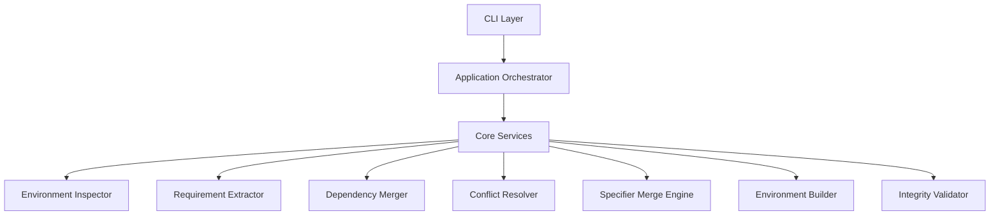
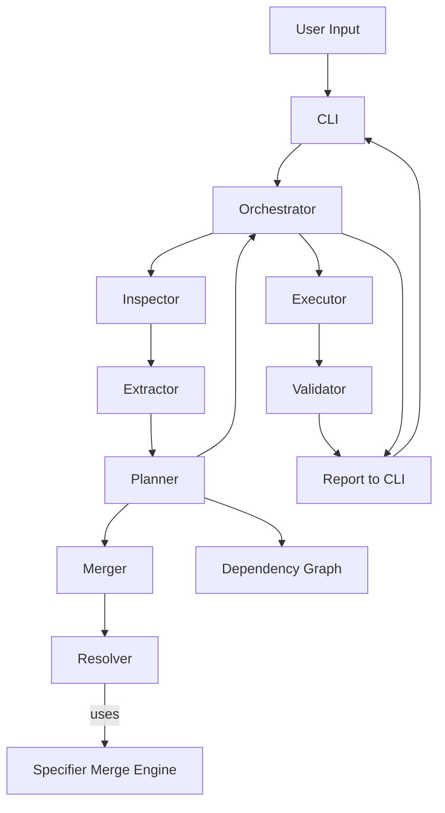

# 🏗️ High-Level System Architecture



---

# 📁 Final Project Structure

```
Pyvenvmerge/
├── 📁 src
│ └── 📁 pyvenvmerge
│ ├── 📁 core
│ │ ├── 🐍 **init**.py
│ │ ├── 🐍 dependency_graph.py
│ │ ├── 🐍 executor.py
│ │ ├── 🐍 extractor.py
│ │ ├── 🐍 inspector.py
│ │ ├── 🐍 merger.py
│ │ ├── 🐍 planner.py
│ │ ├── 🐍 resolver.py
│ │ ├── 🐍 specifier_merge.py
│ │ └── 🐍 validator.py
│ ├── 📁 infra
│ │ ├── 🐍 **init**.py
│ │ ├── 🐍 exceptions.py
│ │ └── 🐍 subprocess_runner.py
│ ├── 📁 models
│ │ ├── 🐍 **init**.py
│ │ ├── 🐍 conflict.py
│ │ ├── 🐍 environment.py
│ │ ├── 🐍 merge_plan.py
│ │ ├── 🐍 merge_report.py
│ │ └── 🐍 requirement.py
│ ├── 🐍 **init**.py
│ ├── 🐍 **main**.py
│ ├── 🐍 cli.py
│ └── 🐍 orchestrator.py
├── ⚙️ .gitignore
├── 📝 ARCHITECTURE.md
├── 📄 LICENSE
├── 📝 README.md
└── ⚙️ pyproject.toml
```

---

# 🔷 Layer 1 — CLI Layer

`cli.py`

Responsibilities:

- Parse arguments
- Validate input paths
- Pass config to orchestrator
- Handle exit codes

No business logic here.

---

# 🔷 Layer 2 — Orchestrator

`orchestrator.py`

Central control flow.

Pseudo-flow:

```

1. Inspect environments
2. Extract dependencies
3. Merge dependency sets
4. Resolve conflicts
5. Create MergePlan
6. Execute plan (create environment + install packages)
7. Run integrity check
8. Generate report

```

The orchestrator coordinates modules — it does not implement logic.

---

# 🔷 Layer 3 — Core Modules

### 1️⃣ inspector.py

Validates:

- Path exists
- pyvenv.cfg exists
- Python executable exists
- Python version compatibility

Returns:

```Python
Environment(
path: Path,
python_version: str,
interpreter_path: Path
)
```

---

### 2️⃣ extractor.py

Extracts dependencies using:

```bash
python -m pip freeze
```

Returns:

```python
dict[str, Requirement]
```

Handles:

- PyPI dependencies
- Editable installs (`-e`)
- Git dependencies (`git+...`)
- File dependencies (`package @ file://...`)

Classifies each dependency by `source_type` and extracts stable identifiers for merging.

---

### 3️⃣ merger.py

Combines multiple requirement dictionaries.

Output:

```
MergedRequirements
```

Does not resolve conflicts — just aggregates.

---

### 4️⃣ resolver.py

Resolver now distinguishes between:

- PyPI dependencies → merged using specifier logic
- Non-PyPI dependencies → pass-through or conflict

Rules:

- PyPI + PyPI → merged via Specifier Merge Engine
- Non-PyPI + Non-PyPI → must match exactly
- Mixed types → conflict

---

### 5️⃣ executor.py

Responsibilities:

- Create virtual environmnet
- Upgrade pip/setuptools/wheel
- Install dependencies in two phases:

1. PyPI dependencies (via requirements file)
2. Non-PyPI dependencies (installed individually)

This ensures correct dependency resolution order and prevents installation failures.

---

### 6️⃣ validator.py

Runs:

```bash
pip check
```

Returns:

```
ValidationResult
```

Ensures:

- No broken requirements
- No dependency conflicts

---

### 7️⃣ specifier_merge.py

Responsible for:

- Merging `SpecifierSet` constraints
- Computing intersection of version ranges
- Detecting incompatible constraints
- Normalizing results (e.g., `>=1.0,<=1.0 → ==1.0`)

This module forms the core of dependency resolution logic and is used by the resolver layer.

---

### 8️⃣ planner.py (v0.5 upgrade)

Responsibilities extended to:

- Conflict classification
- Warning generation
- Dependency graph analysis

New capabilities:

- Detect indirect dependency violations.
- Emit warnings for constraint mismatches.

---

### Conflict Intelligence Layer

Introduced in v0.5.

Adds semantic understanding of dependency conflicts:

- Classifies conflict types
- Generates warnings before execution
- Enables safer dry-run analysis

This layer improves decision visibility without modifying execution logic.

---

### 9️⃣ dependency_graph.py (v0.6 upgrade)

Builds a dependency graph using Python package metadata.

Uses:

```bash
importlib.metadata
```

Responsibilities:

- Map package → dependencies
- Provide dependency information to planner
- Enable transitive conflict analysis

---

# 🔷 Infrastructure Layer

### subprocess_runner.py

Centralized wrapper:

- Capture stdout
- Capture stderr
- Handle non-zero exit
- Timeout handling

Prevents scattered subprocess logic.

---

### filesystem.py

Utilities:

- Write temporary requirement file
- Remove temp files
- Validate directory structure

---

### logger.py

Optional but recommended.

- Structured logging
- Verbosity control
- Debug mode

---

# 🔷 Models Layer

Keep data structured.

### requirement.py

Represents:

```
name
specifier (PEP 440 constraints)
extras
marker
source_type (pypi, git, editable, file)
raw_line
```

---

### environment.py

Represents validated venv.

---

### merge_report.py

Tracks:

- Conflicts
- Selected versions
- Ignored packages
- Warnings

Useful for dry-run mode.

---

# 🔄 Data Flow



---

# 🧠 Design Principles

1. No direct filesystem editing of venv internals
2. Deterministic rebuild
3. Strategy-based conflict resolution
4. Clean separation of logic
5. Reusable core independent of CLI
6. Reproducibility over cleverness
7. Separation of dependencies ypes (PyPI vs external source)

---

# 📦 Future Extensibility

You can later add:

- Lockfile generation
- JSON output mode
- Dry-run report mode
- Interactive conflict resolution
- Support for pyproject.toml export
- Parallel pip install
- Caching layer

Architecture already supports that.

---

# 🔐 Failure Handling Design

Every stage must:

- Fail fast
- Provide clear error
- Return structured result

Exit codes:

| Code | Meaning                        |
| ---- | ------------------------------ |
| 0    | Success                        |
| 1    | Invalid environment            |
| 2    | Version conflict (strict mode) |
| 3    | Installation failure           |
| 4    | Validation failure             |
